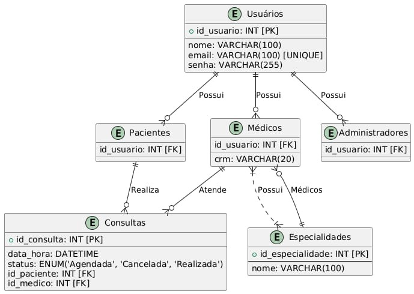

# Integrantes 
- Alexandre Breedveld
- Augusto Fuscaldi Cerezo
- Isabelle Cristine Lucas
- Leandra Costa Ramos
- Lucas de Carvalho Barbosa
- João Pedro Lezsi Fernandes
- Wanessa Dias
- Filipe Faria Melo

## 🏗️ Arquitetura e Governança

### Estilo Arquitetural

O estilo arquitetural escolhido foi o **monolito** e o padrão arquitetural adotado foi o de **camadas**.  
A aplicação de um estilo monolítico combinado com o padrão em camadas é vantajosa para um projeto de **pequeno porte**.

Como o sistema de **gestão de consultas médicas** possui funcionalidades bem definidas e compactas, uma arquitetura monolítica centraliza todos os componentes, **facilitando o desenvolvimento, testes e implantação**. Além de ser menos complexo visando manutenções futuras e sustentabilidade do sistema.

### Padrão em Camadas

Ao adotar o padrão arquitetural em camadas, com as camadas de:

- **Apresentação**
- **Lógica de Negócios**
- **Dados**

o sistema obtém uma **estrutura organizada**, com **separação clara de responsabilidades**.  
Isso torna o código mais **legível**, facilita **manutenções** e **ampliações**, permitindo que mudanças em uma parte do sistema **não impactem diretamente outras**.

Essa abordagem foi escolhida levando em consideração que o projeto é de **pequeno porte** e **sem previsão de integração com outras ferramentas**.  
Dessa forma, oferece **simplicidade**, **baixo custo inicial** e **eficiência** para um projeto que **não requer a complexidade** de arquiteturas distribuídas.

---

### Governança do Projeto

A governança será realizada utilizando os recursos do **GitHub**, por meio de:

- **Commits**
- **Pull Requests**
- **Issues**

Cada nova funcionalidade, correção ou melhoria será desenvolvida em uma **branch separada** e, ao ser concluída, submetida via **Pull Request**.

Esse processo permite:

- Acompanhar quem fez cada alteração
- Revisar o código antes da integração ao projeto principal
- Manter um **histórico organizado** de todas as implementações
- Garantir que o **Design System** será respeitado durante todo o desenvolvimento

---

### Gestão de Tarefas

A separação e acompanhamento das tarefas será feita na aba **Projects**, utilizando o **quadro Kanban**, com as colunas:

- **A Fazer**
- **Em Progresso**
- **Concluído**

Cada tarefa pode ser representada por uma **issue**, atribuída a membros da equipe, contendo **prazos** e **descrições**.  
Essa organização facilita:

- O planejamento
- A priorização das entregas
- A colaboração entre os participantes do projeto

---

## Stack e Comunicação

- Front-end: Desenvolvido com **React.js** e estilizado com **CSS Modules** que são bem estabelecidos no mercado e garantem modularidade e manutenção simplificada.

### Back-end

O sistema foi desenvolvido com **Java** utilizando o framework **Spring Boot**, que simplifica bastante a criação de aplicações web e APIs REST. O Spring Boot traz várias configurações prontas, o que permite focar mais na lógica de negócio do que em detalhes de infraestrutura. Ele também facilita o controle das rotas, o tratamento de requisições HTTP e a integração com bancos de dados, mantendo o código limpo e bem organizado.

### Comunicação

A comunicação entre o front-end e o back-end é feita por meio de uma **API REST**, com os dados trafegando no formato **JSON**. Esse padrão é amplamente utilizado e bem aceito, o que facilita tanto o desenvolvimento quanto a manutenção. Além disso, o uso de REST permite implementar mecanismos de segurança, como autenticação via JWT, de forma eficiente e padronizada.

---

## Segurança

* **Autenticação:** A aplicação utiliza **JWT (JSON Web Token)** para autenticar os usuários e proteger as rotas sensíveis. Com isso, é possível garantir que apenas usuários autorizados tenham acesso a determinadas funcionalidades, sem depender de sessões de servidor, o que combina bem com APIs REST.

**Armazenamento de senhas**: As senhas são protegidas utilizando um hash simples com SHA-256, uma abordagem leve e suficiente para o nível de segurança esperado na aplicação. Isso garante que as senhas não sejam armazenadas em texto puro e evita exposições básicas em caso de vazamento do banco de dados.

## Características do Projeto

* **Baixo acoplamento:** Mesmo com uma arquitetura monolítica, a estrutura em camadas adotada no projeto contribui para um baixo acoplamento entre os componentes. Isso facilita a manutenção e evolução do sistema. No entanto, se a aplicação crescer muito, o estilo monolítico pode acabar dificultando a organização e o isolamento de funcionalidades.

* **Escalabilidade:** A organização em camadas permite escalar a aplicação de forma relativamente tranquila no início. Contudo, à medida que o sistema cresce, o monolito pode se tornar mais difícil de manter. A adição de novas funcionalidades, testes e atualizações podem impactar partes do sistema que, idealmente, deveriam ser independentes.

* **Escolha da stack:** A stack foi escolhida por ser **conhecida**, **estável no mercado** e **bem documentada**. O uso de Java com Spring Boot oferece uma base sólida para projetos robustos, com uma comunidade ativa e diversas bibliotecas prontas para uso, o que facilita bastante o desenvolvimento.
---
# 🎨 Style Guide 

#### Light Mode

| Nome          | Código HEX | Uso Principal                        |
| ------------- | ----------- | ------------------------------------ |
| Primária      | #007E85     | Botões, links, bordas                |
| Black Light   | #1C1B1F     | Bordas de inputs e placeholders      |
| Neutro claro  | #C3C3C3     | Textos principais                    |
| Black         | #000000     | Textos principais                    |
| Error         | #EE0202     | Erros, alertas críticos              |
| White         | #FFFFFF     | Backgrounds da tela e cards          |

#### Dark Mode

| Nome             | Código HEX | Uso Principal                        |
| ---------------- | ----------- | ------------------------------------ |
| Fundo principal  | #121212     | Background geral da tela             |
| Fundo de cards   | #1C1C1C     | Background de cards e inputs         |
| Texto principal  | #FFFFFF     | Textos principais                    |
| Texto secundário | #B0B0B0     | Textos auxiliares e placeholders     |
| Borda de inputs  | #333333     | Bordas de inputs e cards             |
| Primária         | #007E85     | Botões, links, bordas                |
| Error            | #EE0202     | Erros, alertas críticos              |

---

## Tipografia

| Tipo     | Fonte Principal | Peso     | Uso                            |
| -------- | ---------------- | -------- | ------------------------------ |
| Títulos  | Poppins           | Bold     | Títulos, cabeçalhos             |
| Corpo    | Poppins           | SemiBold | Textos de botões e links        |
| Auxiliar | Poppins           | Regular  | Textos de inputs e descrições   |

---

## Componentes UI

### Botões

| Variante    | Cor      | Borda | Texto  | Uso                                     |
| ----------- | -------- | ----- | ------ | --------------------------------------- |
| Primário    | #2A9D8F  | 4px   | Branco | Ações principais (criar conta, login)   |
| Secundário  | #EE0202  | 15px  | Branco | Ações de exclusão e cancelamento        |
| Desabilitado| #D1D5DB  | Não   | #9CA3AF| Estado inativo                         |

---

### Inputs

- **Altura**: 66px
- **Bordas arredondadas**: 8px
- **Placeholder**:
  - Light Mode: cor `#1C1B1F`
  - Dark Mode: cor `#B0B0B0`
- **Tipos**: Text, Password, Email, Date, Select
- **Fundo**:
  - Light Mode: `#FFFFFF`
  - Dark Mode: `#1C1C1C`
- **Borda**:
  - Light Mode: `#C3C3C3`
  - Dark Mode: `#333333`

---

### Cards

- **Fundo**:
  - Light Mode: `#FFFFFF`
  - Dark Mode: `#1C1C1C`
- **Borda**: 1px sólida
  - Light Mode: `#007E85`
  - Dark Mode: `#333333`
- **Bordas arredondadas**: 10px
- **Padding interno**: 16px

---

### Ícones

- **Tamanho padrão**: 24px
- **Cor**:
  - Light Mode: herdam cor do texto preto ou primária
  - Dark Mode: herdam cor do texto branco ou primária

---

## 🌗 Como alternar entre Light e Dark Mode

A troca entre temas deve ajustar:
- Fundo da tela e cards
- Cor de textos e ícones
- Cor de bordas dos inputs
- **Cores dos botões** podem permanecer as mesmas (apenas hover/disabled com leve clareamento no dark)

---

## Observação Final

As cores principais da marca (**verde `#007E85`** e **vermelho `#EE0202`**) **não mudam** entre Light e Dark Mode para manter a identidade visual consistente.

---

# Decisões de Acessibilidade e Boas Práticas de Design

## Contraste e Visibilidade
- As cores foram escolhidas para manter **alto contraste** entre texto, botões e fundo, em ambos os modos (claro e escuro), atendendo os critérios da **WCAG 2.1**.
- Isso garante a leitura confortável para pessoas com baixa visão, daltonismo ou em ambientes com iluminação variada.

## Consistência Visual
- A **manutenção das cores principais** entre os modos assegura que usuários associem rapidamente ações importantes (como confirmações e erros).
- Ícones e textos seguem o mesmo princípio de contraste para manter a compreensão mesmo sem dependência de cor isoladamente (bom para usuários com deficiências de percepção de cor).

## Área clicável 
- Botões e campos de input têm **tamanho mínimo adequado** para toque (mínimo 44px recomendado pelo Google), facilitando o uso em dispositivos móveis.

## Tipografia
- Fonte **Poppins** foi escolhida por sua ótima legibilidade e variações de peso (Bold, SemiBold, Regular), possibilitando diferenciação clara entre títulos, botões e descrições.

## Adaptação de Tema
- O suporte nativo a **Light/Dark Mode** respeita preferências do sistema operacional do usuário, promovendo conforto visual.

---

## Camada de Dados

O MySQL é uma boa escolha pelos seguintes aspectos:

1.  *Maturidade e Confiabilidade:* São sistemas de gerenciamento de banco de dados relacionais (RDBMS) open-source estabelecidos, com um longo histórico de uso em produção e conhecidos pela sua estabilidade.
2.  *Popularidade e Comunidade:* Possuem uma vasta comunidade de usuários, o que significa ampla documentação, tutoriais, fóruns de suporte e profissionais qualificados disponíveis.
3.  *Custo:* Sendo open-source, geralmente não implicam custos de licenciamento, o que pode ser vantajoso para muitos projetos.
4.  *Performance:* Oferecem bom desempenho para uma grande variedade de aplicações, especialmente aplicações web e sistemas transacionais, com muitas opções de otimização (como indexação).
5.  *Ecossistema:* São compatíveis com a maioria das linguagens de programação, frameworks e ferramentas de desenvolvimento e administração.
6.  *Funcionalidades:* Suportam o padrão SQL, transações ACID (com engines como InnoDB), replicação, particionamento e outros recursos essenciais para aplicações robustas.
7.  *Segurança:* Autenticação baseada em usuários e permissões granulares (GRANT, REVOKE). SSL/TLS para conexões criptografadas. Suporte a plugins de autenticação externa (como LDAP ou PAM). Suporte a roles (funções) (a partir da versão 8). Auditoria (disponível com plugins).

 ### Diretrizes do Banco de Dados

- **1. Convenções de Nomenclatura**

- **Tabelas e Colunas**

    - Usar underscore "_" para os nomes das tabelas e colunas. (Exemplo: id_medico, id_paciente, data_hora, etc.)

- **2. Relacionamentos**
  
    - Utilize chaves estrangeiras (FOREIGN KEY) para garantir a integridade referencial.
 
    - Para representar uma tabela que é a generalização de outras tabelas, utilize uma chave estrangeira (referindo-se a tabela de generalização) nas tabelas especializadas. (Exemplo: Tabela usuário é uma generalização das tabelas Pacientes, Médicos e administradores. Estas tabelas possuem a FK id_usuario como identificador)
      
- **3. Regras de Negócio na Camada de Persistência**
  
  - 3.1 Validação de Consultas

    Agendamento de consulta: Não aceitar horários inválidos. Não permitir agendamento em horários já ocupados.

    Status da consulta: A consulta pode ter os status agendada, concluida ou cancelada.

  - 3.2 Validação de usuário
  
    Email: Não permitir o cadastro de emails inválidos, inexistentes ou já cadastrados.
    
    Médicos: Devem possuir um CRM válido cadastrado.
    
    Senha: Senha do usuário deve possuir pelo menos 9 caracteres, uma letra maiúscula, um caractere especial e um número.

- **4. Segurança**

    - Garantir o controle de acesso e perfis (paciente, médico, administrador).

    - Garantir a criptografia de senhas e dados sensíveis.
  

## Boas Práticas: Prefixos padrões para nomes de colunas no banco de dados

| Tipo de Dado         | Prefixo Sugerido | Exemplo              | Descrição                                     |
|----------------------|------------------|----------------------|-----------------------------------------------|
| ID principal         | `id_`            | `id_usuario`         | Identificador único da entidade               |
| Chave estrangeira    | `fk_`            | `fk_endereco`        | Referência a outra tabela                     |
| Nome                 | `nm_`            | `nm_cliente`         | Nome próprio ou descritivo                    |
| Descrição            | `ds_`            | `ds_produto`         | Texto descritivo                              |
| Email                | `em_`            | `em_contato`         | Endereço de e-mail                            |
| Telefone             | `tel_`           | `tel_residencial`    | Número de telefone                            |
| Endereço             | `end_`           | `end_logradouro`     | Componentes de endereço                       |
| Quantidade           | `qnt_`           | `qnt_estoque`         | Quantidade de itens ou registros             |
| Valor monetário      | `vl_`            | `vl_total`           | Valores financeiros ou monetários             |
| Número genérico      | `nr_`            | `nr_documento`       | Números em geral (ex: CPF, RG, matrícula)     |
| Data                 | `dt_`            | `dt_nascimento`      | Qualquer valor do tipo data                   |
| Hora                 | `hr_`            | `hr_agendamento`     | Hora específica                               |
| Timestamp            | `ts_`            | `ts_criacao`         | Data e hora completas (com segundos/miliseg.) |
| Indicador booleano   | `fl_`            | `fl_ativo`           | Flag (0/1, true/false)                        |
| URL / Caminho        | `url_`           | `url_foto_perfil`   | Endereço de arquivo, imagem, etc.              |
| Nome de arquivo      | `arq_`           | `arq_documento`      | Nome do arquivo ou mídia                      |

## Observações, limitações e pontos fracos a levar em consideração:

| Item                              | Situação no MySQL                                     | Melhorias implementáveis                                                                                                  |
|-----------------------------------|-------------------------------------------------------|---------------------------------------------------------------------------------------------------------------------------|
| Criptografia em repouso (at rest) | Só disponível no MySQL Enterprise                     | Possível investimento monetário no MySQL Enterprise.                                                                      |
| Auditoria detalhada               | Não nativo                                            | Audit Plugins de terceiros. Ex: McAfee Audit Plugin Registra comandos SQL, logins, alterações de dados.                   |
| Controle de acesso por linha      | Não nativo                                            | Pode ser feita com views e triggers que são acessadas pela aplicação ao invés das tabelas diretamente.                    |
