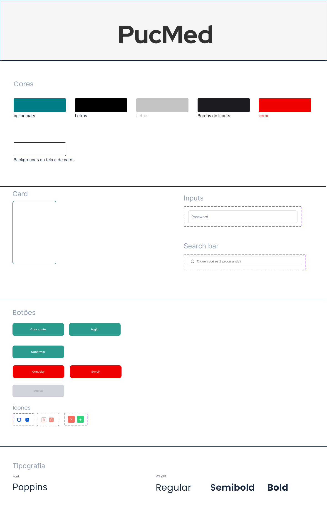

## 🏗️ Arquitetura e Governança

### Estilo Arquitetural

O estilo arquitetural escolhido foi o **monolito** e o padrão arquitetural adotado foi o de **camadas**.  
A aplicação de um estilo monolítico combinado com o padrão em camadas é vantajosa para um projeto de **pequeno porte**.

Como o sistema de **gestão de consultas médicas** possui funcionalidades bem definidas, uma arquitetura monolítica centraliza todos os componentes, **facilitando o desenvolvimento, testes e implantação**.

### Padrão em Camadas

Ao adotar o padrão arquitetural em camadas, com as camadas de:

- **Apresentação**
- **Lógica de Negócios**
- **Dados**

o sistema obtém uma **estrutura organizada**, com **separação clara de responsabilidades**.  
Isso torna o código mais **legível**, facilita **manutenções** e **ampliações**, permitindo que mudanças em uma parte do sistema **não impactem diretamente outras**.

Essa abordagem foi escolhida levando em consideração que o projeto é de **pequeno porte** e **sem previsão de integração com outras ferramentas**.  
Dessa forma, oferece **simplicidade**, **baixo custo inicial** e **eficiência** para um projeto que **não requer a complexidade** de arquiteturas distribuídas.

---

### Governança do Projeto

A governança será realizada utilizando os recursos do **GitHub**, por meio de:

- **Commits**
- **Pull Requests**
- **Issues**

Cada nova funcionalidade, correção ou melhoria será desenvolvida em uma **branch separada** e, ao ser concluída, submetida via **Pull Request**.

Esse processo permite:

- Acompanhar quem fez cada alteração
- Revisar o código antes da integração ao projeto principal
- Manter um **histórico organizado** de todas as implementações
- Garantir que o **Design System** será respeitado durante todo o desenvolvimento

---

### Gestão de Tarefas

A separação e acompanhamento das tarefas será feita na aba **Projects**, utilizando o **quadro Kanban**, com as colunas:

- **A Fazer**
- **Em Progresso**
- **Concluído**

Cada tarefa pode ser representada por uma **issue**, atribuída a membros da equipe, contendo **prazos** e **descrições**.  
Essa organização facilita:

- O planejamento
- A priorização das entregas
- A colaboração entre os participantes do projeto

---
# 🎨 Style Guide 

#### Light Mode

| Nome          | Código HEX | Uso Principal                        |
| ------------- | ----------- | ------------------------------------ |
| Primária      | #007E85     | Botões, links, bordas                |
| Black Light   | #1C1B1F     | Bordas de inputs e placeholders      |
| Neutro claro  | #C3C3C3     | Textos principais                    |
| Black         | #000000     | Textos principais                    |
| Error         | #EE0202     | Erros, alertas críticos              |
| White         | #FFFFFF     | Backgrounds da tela e cards          |

#### Dark Mode

| Nome             | Código HEX | Uso Principal                        |
| ---------------- | ----------- | ------------------------------------ |
| Fundo principal  | #121212     | Background geral da tela             |
| Fundo de cards   | #1C1C1C     | Background de cards e inputs         |
| Texto principal  | #FFFFFF     | Textos principais                    |
| Texto secundário | #B0B0B0     | Textos auxiliares e placeholders     |
| Borda de inputs  | #333333     | Bordas de inputs e cards             |
| Primária         | #007E85     | Botões, links, bordas                |
| Error            | #EE0202     | Erros, alertas críticos              |

---

## Tipografia

| Tipo     | Fonte Principal | Peso     | Uso                            |
| -------- | ---------------- | -------- | ------------------------------ |
| Títulos  | Poppins           | Bold     | Títulos, cabeçalhos             |
| Corpo    | Poppins           | SemiBold | Textos de botões e links        |
| Auxiliar | Poppins           | Regular  | Textos de inputs e descrições   |

---

## Componentes UI

### Botões

| Variante    | Cor      | Borda | Texto  | Uso                                     |
| ----------- | -------- | ----- | ------ | --------------------------------------- |
| Primário    | #2A9D8F  | 4px   | Branco | Ações principais (criar conta, login)   |
| Secundário  | #EE0202  | 15px  | Branco | Ações de exclusão e cancelamento        |
| Desabilitado| #D1D5DB  | Não   | #9CA3AF| Estado inativo                         |

---

### Inputs

- **Altura**: 66px
- **Bordas arredondadas**: 8px
- **Placeholder**:
  - Light Mode: cor `#1C1B1F`
  - Dark Mode: cor `#B0B0B0`
- **Tipos**: Text, Password, Email, Date, Select
- **Fundo**:
  - Light Mode: `#FFFFFF`
  - Dark Mode: `#1C1C1C`
- **Borda**:
  - Light Mode: `#C3C3C3`
  - Dark Mode: `#333333`

---

### Cards

- **Fundo**:
  - Light Mode: `#FFFFFF`
  - Dark Mode: `#1C1C1C`
- **Borda**: 1px sólida
  - Light Mode: `#007E85`
  - Dark Mode: `#333333`
- **Bordas arredondadas**: 10px
- **Padding interno**: 16px

---

### Ícones

- **Tamanho padrão**: 24px
- **Cor**:
  - Light Mode: herdam cor do texto preto ou primária
  - Dark Mode: herdam cor do texto branco ou primária

---

## 🌗 Como alternar entre Light e Dark Mode

A troca entre temas deve ajustar:
- Fundo da tela e cards
- Cor de textos e ícones
- Cor de bordas dos inputs
- **Cores dos botões** podem permanecer as mesmas (apenas hover/disabled com leve clareamento no dark)

---

## Observação Final

As cores principais da marca (**verde `#007E85`** e **vermelho `#EE0202`**) **não mudam** entre Light e Dark Mode para manter a identidade visual consistente.

---

# Decisões de Acessibilidade e Boas Práticas de Design

## Contraste e Visibilidade
- As cores foram escolhidas para manter **alto contraste** entre texto, botões e fundo, em ambos os modos (claro e escuro), atendendo os critérios da **WCAG 2.1**.
- Isso garante a leitura confortável para pessoas com baixa visão, daltonismo ou em ambientes com iluminação variada.

## Consistência Visual
- A **manutenção das cores principais** entre os modos assegura que usuários associem rapidamente ações importantes (como confirmações e erros).
- Ícones e textos seguem o mesmo princípio de contraste para manter a compreensão mesmo sem dependência de cor isoladamente (bom para usuários com deficiências de percepção de cor).

## Área clicável 
- Botões e campos de input têm **tamanho mínimo adequado** para toque (mínimo 44px recomendado pelo Google), facilitando o uso em dispositivos móveis.

## Tipografia
- Fonte **Poppins** foi escolhida por sua ótima legibilidade e variações de peso (Bold, SemiBold, Regular), possibilitando diferenciação clara entre títulos, botões e descrições.

## Adaptação de Tema
- O suporte nativo a **Light/Dark Mode** respeita preferências do sistema operacional do usuário, promovendo conforto visual.

---
